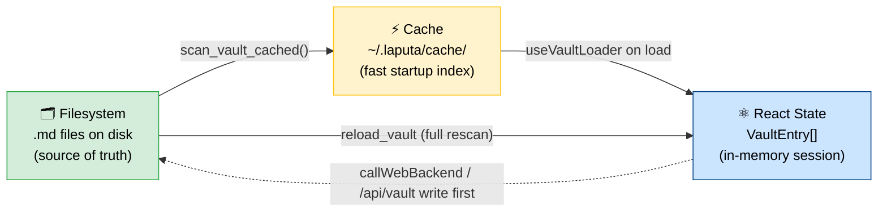
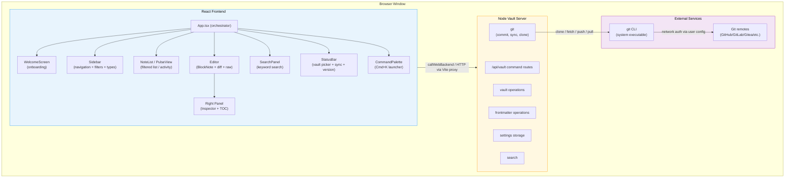
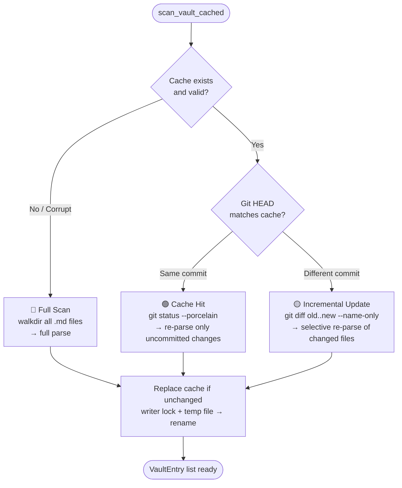
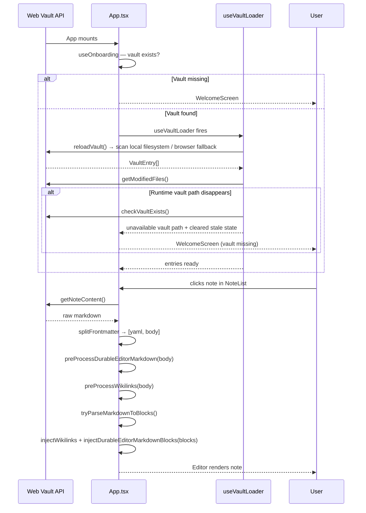
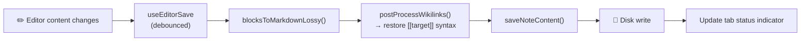
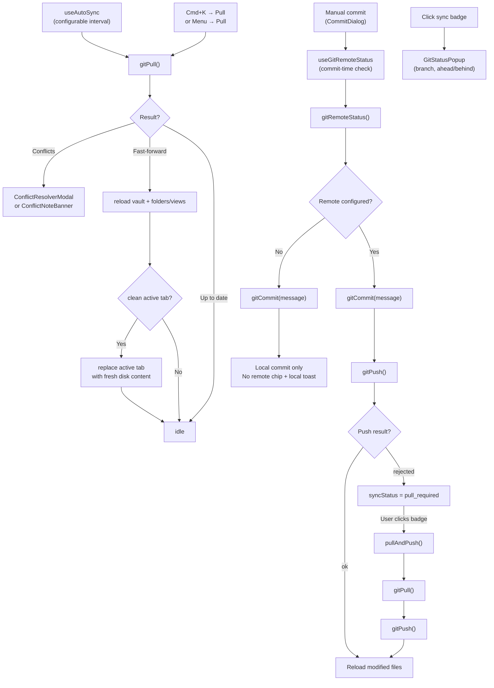
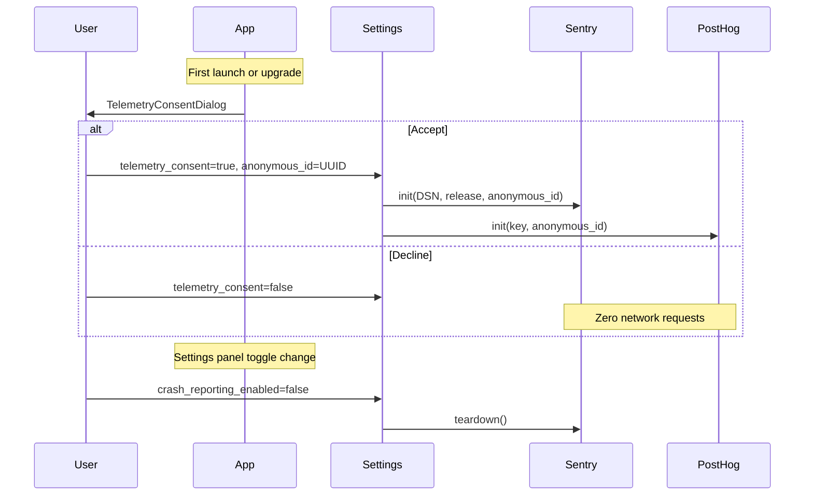

# Architecture

Artemis is a personal knowledge and life management web app. It reads a vault of markdown files with YAML frontmatter through the local web vault API (or a browser-local demo vault) and presents them in a four-panel UI inspired by Bear Notes.

## Design Principles

### Filesystem as the single source of truth

The vault is a folder of plain markdown files. The app never owns the data — it only reads and writes files. The cache, React state, and any in-memory representation are always derived from the filesystem and must be reconstructible by deleting them. When in doubt, the file on disk wins.

### Convention over configuration

Artemis is opinionated. Standard field names (`type:`, `status:`, `url:`, `Workspace:`, `belongs_to:`, `related_to:`, `has:`, `start_date:`, `end_date:`) have well-defined meanings and trigger specific UI behavior — without any setup. Relationship defaults are stored in snake_case on disk and humanized in the UI. This is not convention *instead of* configuration: users can override defaults via config files in their vault (e.g. `config/relations.md`, `config/semantic-properties.md`). But the defaults work out of the box, and most users never need to touch them.


### Where to store state: vault vs. app settings

When deciding where to persist a piece of data, ask: **"Would the user want this to follow them across all their Artemis installations — other devices, future platforms (tablet, web)?"**

| Follows the vault | Stays with the installation |
|-------------------|-----------------------------|
| Type icon, type color | Editor zoom level |
| Pinned properties per type | Installation-specific app preferences |
| Sidebar label overrides | Auto-sync interval |
| Property display order | Window size / position |
| Per-note `_width` rich-editor width override | Default rich-editor note width |
| Vault-authored `.gitignore` patterns | Whether this installation hides Gitignored files |
| Per-vault All Notes note-list column overrides | All Notes PDF/image/unsupported file visibility |
| Any user-visible customization of how content is organized or displayed | Any machine-specific or credential-type setting |

**Rule:** If the information is about *how the content is structured or presented* and the user would expect it to be consistent wherever they open their vault, store it in the vault (frontmatter of the relevant note, using the `_field` underscore convention for system properties). If it's about *this specific installation of the app*, store it in `~/.config/com.tolaria.app/settings.json` or localStorage.

Examples:
- ✅ Vault: `_pinned_properties` in a Type note (every device should show the same pinned properties)
- ✅ Vault: `_icon: shapes` in a Type note (icon is part of the type's identity)
- ✅ Vault: `_width: wide` in a note that already has frontmatter (per-note reading/editing preference)
- ✅ App settings: `zoom: 1.3` (machine-specific preference)
- ✅ App settings: `ui_language: "zh-CN"` (installation-specific UI language)
- ✅ App settings: `note_width_mode: "wide"` (installation-specific default for notes without an override)
- ✅ App settings: `all_notes_show_images: true` (installation-specific All Notes file-category visibility)

### No hardcoded exceptions

No field names, folder paths, or vault-specific values should be hardcoded in the application source code. What can be a convention should be a convention. What needs to be configurable should live in a file. Relationship fields are detected dynamically by checking whether values contain `[[wikilinks]]` — no hardcoded field name lists.

### Local-first knowledge graph

Notes are not just documents — they are nodes in a structured graph of people, projects, events, responsibilities, and ideas. Every design decision should ask: "Does this make the knowledge graph easier for a human to navigate?" Conventions that are legible to both are better than conventions that are legible only to one.

### Three representations, one authority

Vault data exists in three forms simultaneously:
1. **Filesystem** — the `.md` files on disk. This is the single source of truth.
2. **Cache** — `~/.laputa/cache/<hash>.json`, an index for fast startup. Always reconstructible from the filesystem.
3. **React state** — the in-memory `VaultEntry[]` during a session. Always derived from the cache or filesystem.

These must never diverge permanently. If they do, the filesystem wins and the cache/state are rebuilt.



#### Ownership rules

| Layer | Owner | Writes to | Reads from |
|-------|-------|-----------|------------|
| Filesystem | Web vault backend functions/routes (`saveNoteContent()`, frontmatter save helpers, etc.) | Disk | — |
| Transient content cache | `useTabManagement` / `useEditorTabSwap` | In-memory tab/content caches | Current `VaultEntry` identity + local API validation |
| React state | `useVaultLoader` + `useEntryActions` + `useNoteActions` | In-memory `entries` | Filesystem scan / browser fallback state |

#### Invariants

1. **Disk-first writes**: All functions that change vault data must write through the web backend *before* updating React state. This ensures that if the disk write fails, React state remains consistent with what's actually on disk.
2. **Optimistic UI with rollback**: Where responsiveness matters (e.g. `persistOptimistic` in `useNoteCreation`), state may update before disk confirmation — but a failure callback must revert the optimistic state.
3. **No orphan state updates**: Never call `updateEntry()` before the corresponding `handleUpdateFrontmatter()` or `handleDeleteProperty()` has resolved. The three functions in `useEntryActions` (`handleCustomizeType`, `handleRenameSection`, `handleToggleTypeVisibility`) follow this rule — disk write first, then state update.
4. **Recovery via reload**: If state ever diverges from disk (crash, external edit, race condition), `Reload Vault` (Cmd+K → "Reload Vault") performs a filesystem rescan via `reloadVault()`, replacing React state. `reloadVaultEntry()` can re-read a single file.
5. **Caches are disposable**: Renderer caches are performance hints only. A reload or identity mismatch discards them and reads the local API/mock store again.
6. **Visibility filters are renderer concerns**: All Notes file-kind visibility and gitignored visibility toggles live in React settings/state. The current web vault API scans non-hidden files and does not implement the old backend `git check-ignore` filter.

#### External Change Detection

The web build detects external vault changes by polling `/api/vault/snapshot` through `useVaultWatcher`. The hook diffs file identity snapshots, suppresses recent app-owned saves, and sends changed paths through `refreshPulledVaultState()` so folders, saved views, note-list state, and the clean active editor all refresh under the ADR-0071 unsaved-edit rules. `useVaultLoader.isReloading` drives the status-bar reload spinner for both manual and watcher-triggered reloads.

#### Progressive Vault Loading

Vault opening is allowed to render the main app shell while the full entry scan is still in flight. `useVaultLoader` keeps `isLoading` true until entries are ready, but folders and saved views load independently so the sidebar can become useful before the note index completes. The status bar uses the vault activity badge during this initial indexing state, while command-palette and editor-shell interactions remain mounted instead of being hidden behind the full app skeleton. The full skeleton is reserved for app-level capability checks such as the initial Git-state probe.

Large-vault reproduction and keyboard QA steps live in [LARGE-VAULT-LOADING-QA.md](./LARGE-VAULT-LOADING-QA.md).

#### Note Opening Fast Path

Note opening uses bounded in-memory fast paths for raw content and parsed editor blocks. `useTabManagement` owns the markdown/text prefetch cache and treats every cached value as a performance hint only: identity-matched entries (`modifiedAt` + `fileSize`) can be reused immediately, while identity-missing or identity-mismatched cached text is checked with `validateNoteContent()`, which compares the cached text with the current file bytes through the local web API. If validation fails, Artemis discards the cached entry and reads fresh disk content before swapping the editor.

The note list opportunistically preloads visible and adjacent markdown/text entries after a short delay. When a large warmed Markdown note resolves, `useEditorTabSwap` may parse it into a bounded parsed-block cache only after foreground editor work has been idle and the rich editor is mounted. Parsed blocks are keyed by vault, path, and exact source content; every async swap carries a generation/source-content token so stale conversion results cannot overwrite newer file content or dirty editor state. The editor never renders a preview surface that later morphs into BlockNote. See [ADR-0105](./adr/0105-editor-correctness-and-responsiveness-contract.md).

## Tech Stack

| Layer | Technology | Version |
|-------|-----------|---------|
| Frontend | React + TypeScript | React 19, TS 5.9 |
| Editor | BlockNote | 0.46.2 |
| Code block highlighting | @blocknote/code-block | 0.46.2 |
| Diagram rendering | Mermaid | 11.14.0 |
| Whiteboard rendering | tldraw | 4.5.10 |
| Raw editor | CodeMirror 6 | - |
| Styling | Tailwind CSS v4 + CSS variables | 4.1.18 |
| UI primitives | Radix UI + shadcn/ui | - |
| Icons | Phosphor Icons + Lucide | - |
| Build | Vite | 7.3.1 |
| Web vault backend | Standalone Node HTTP `/api/vault` server package + browser fallback handlers | - |
| Frontmatter parsing | gray_matter | 0.2 |
| Filesystem watcher | Web snapshot polling | - |
| Search | Keyword (walkdir-based file scan) | - |
| Localization | App-owned runtime + JSON catalogs (`src/lib/i18n.ts`, `src/lib/locales/*.json`, `lara.yaml`) | English fallback + Lara CLI sync |
| Tests | Vitest (unit), Playwright (E2E/smoke) | - |
| Package manager | pnpm | - |

## System Overview



## Web Vault Server

The local `/api/vault/*` implementation lives in `packages/vault-server/src/` instead of `vite.config.ts`. The package exports `handleVaultApiRequest()` for adapters and `createVaultHttpServer()` / `startVaultServer()` for the standalone Node lifecycle. During development, `pnpm dev` launches the Node vault server on `ARTEMIS_API_HOST` / `ARTEMIS_API_PORT` (default `127.0.0.1:5302`) and Vite separately; Vite proxies `/api/vault` to that server so frontend code continues to use relative API URLs. `src/backend/web-command-handlers.ts` remains the browser-local fallback path for demo/offline tests when the HTTP bridge is unavailable.

## Four-Panel Layout

```
┌────────┬─────────────┬─────────────────────────┬────────────┐
│Sidebar │ Note List   │ Editor                  │ Right Panel│
│(250px) │ (300px)     │ (flex-1)                │ (280px)    │
│        │ OR          │                         │ OR         │
│ All    │ Pulse View  │ [Breadcrumb Bar]        │ TOC        │
│ Changes│             │                         │ OR         │
│ Pulse  │ [Search]    │ # My Note               │ Inspector  │
│ Inbox  │ [Sort/Filt] │                         │            │
│        │             │                         │ Context    │
│Projects│ Note 1      │ Content here...         │ Messages   │
│Experim.│ Note 2      │ (BlockNote or Raw)      │ Actions    │
│Respons.│ Note 3      │                         │ Input      │
│People  │ ...         │                         │            │
│Events  │             │                         │            │
│Topics  │             │                         │            │
├────────┴─────────────┴─────────────────────────┴────────────┤
│ StatusBar: v0.4.2 │ main │ Synced 2m ago │ Vault: ~/Laputa │
└──────────────────────────────────────────────────────────────┘
```

- **Sidebar** (220-400px, resizable): Top-level filters (All Notes, Changes, Pulse), saved Views, collapsible type-based section groups, and a dedicated folder tree. The folder tree starts with a vault-root row labeled from the opened vault path, shows root-level files when selected, and nests user-created folders plus default vault folders such as `attachments/` and `views/` underneath it; only the dedicated `type/` directory stays hidden because note types already have their own sidebar section. Saved Views persist a top-level YAML `order` field in each view file and use the same ordered-list mental model as Types: pointer users can drag the existing view row, double-click to rename it, or right-click for edit/rename/appearance/delete actions, while keyboard users can use the row context key for the same menu and command-palette move actions for ordering. The folder tree supports inline folder creation and rename, exposes a right-click menu for copy-path/rename/delete actions, and auto-expands ancestor folders when the current selection or rename target is nested. Type sections and folder rows also act as note drop targets: dropping a note on a type updates its `type:` frontmatter, while dropping it on a folder runs the same crash-safe move path as the command palette flow. Each type can have a custom icon, color, sort, and visibility set via its `type: Type` document; new type documents created by Artemis are written at the vault root.
- **Note List / Pulse View** (220-500px, resizable): When a section group, filter, or saved view is selected, shows filtered notes with snippets, modified dates, status indicators, and per-context note-list controls. When `selection.kind === 'entity'`, the same pane enters **Neighborhood** mode: the source note is pinned at the top as a normal active row, outgoing relationship groups render first, inverse/backlink groups follow, empty groups stay visible with `0`, and duplicates across groups are allowed when multiple relationships are true. Plain click / `Enter` open the focused note without replacing the current Neighborhood, while Cmd/Ctrl-click and Cmd/Ctrl-`Enter` pivot the pane into the clicked note's Neighborhood. Folder-backed lists also show non-Markdown files: previewable image and PDF binaries get file indicators and open in the editor pane, while unsupported binaries remain muted instead of auto-launching an external app. Saved views reuse the same sort and visible-column controls as the built-in lists, and those changes persist back into the view `.yml` definition (`sort`, `listPropertiesDisplay`). When Pulse filter is active, shows `PulseView` — a chronological git activity feed grouped by day.
- **Editor** (flex, fills remaining space): Single note open at a time (no tabs — see ADR-0003). Breadcrumb bar with word count, rich-editor width toggle, copy-path, and the secondary-overflow Table of Contents action, BlockNote rich text editor with wikilink support, Markdown-compatible inline/display math rendering, first-class Mermaid diagram blocks, markdown-safe formatting controls, and schema-backed fenced code block highlighting via `@blocknote/code-block`. Can toggle to diff view (modified files), raw CodeMirror view, or a wide rich-editor reading surface with preserved side margins; raw CodeMirror remains full-width and unaffected by note width mode. Inline rich-editor images open in a localized shadcn lightbox on double-click while normal single-click BlockNote selection remains untouched, and tiny tracking-style images are ignored. Binary image and PDF files render through `FilePreview` as ordinary vault files; unsupported/broken binaries show explicit in-app fallback states and keyboard focus returns to the note list on `Escape`. Decomposed into `Editor` (orchestrator), `EditorContent`, `FilePreview`, `EditorRightPanel`, `TableOfContentsPanel`, `SingleEditorView`, with hooks `useDiffMode`, `useEditorFocus`, and `useEditorSave`, plus the `useRawMode`/`RawEditorView` pair for markdown source editing. Rich BlockNote input and raw CodeMirror input both route typed `->`, `<-`, and `<->` through the shared `src/utils/arrowLigatures.ts` resolver so arrow ligatures stay consistent across mode switches while escaped ASCII sequences remain literal. Navigation history (Cmd+[/]) replaces tabs.

  BlockNote tables are contained by `EditorTheme.css` instead of schema changes. The table block clips horizontal overflow to the editor width, preserves BlockNote's explicit column widths with `width: max-content`, and allows automatic-width tables to fit the note surface with `max-width: 100%`. Cells use `overflow-wrap: anywhere`, `white-space: normal`, and viewport-bounded max widths so long words wrap in Chromium and Firefox; the Safari/WebKit path uses the same standard CSS plus `-webkit-overflow-scrolling: touch` for mobile overflow. Validation status for the table responsive CSS is: Chromium responsive-layout check passed (5/5), Firefox table-browser suite passed (13/13 across 1280×720, 1920×1080, 390×844, and 768×1024), and Safari/WebKit automation was skipped on this Linux host because Playwright WebKit could not launch due missing system libraries after the task owner explicitly allowed skipping Playwright-only checks.
- **Right side panels** (200-500px or hidden): Properties and Table of Contents are coordinated by `EditorRightPanel` and `useRightPanelExclusion`.

Panels are separated by `ResizeHandle` components that support drag-to-resize. `useLayoutPanels` clamps the sidebar, note-list, and inspector widths before applying them, keeps the side panes from flex-shrinking below their protected widths, and persists the last chosen widths in installation-local localStorage under `tolaria:layout-panels`.

Artemis now relies on browser window management. The React layout clamps and persists pane widths in localStorage, but it does not resize the host OS window, mount custom Linux chrome, or open secondary note windows.

## Search

Search is keyword-based, using `walkdir` to scan all `.md` files in the vault directory. No external binary or indexing step required.

- Matches query against file titles and content (case-insensitive)
- Scores results: title matches ranked higher than content-only matches
- Extracts contextual snippets around the first match
- Skips hidden files

The `search_vault` web backend command returns results sorted by relevance score.

## Vault Cache System

The vault cache accelerates vault scanning using git-based incremental updates in the web vault backend.

### Cache File

`~/.laputa/cache/<vault-hash>.json` — stored outside the vault directory so it never pollutes the user's git repo. The vault path is normalized through `vault/path_identity.rs` before hashing, so macOS `/tmp` aliases and separator variants share the same cache identity. Stores: vault path, git HEAD commit hash, all VaultEntry objects. Version: v13 (bumped on VaultEntry field changes to force full rescan). Cache replacement is best-effort: Artemis writes a temp file, fsyncs it, and renames it into place only after a short-lived writer lock plus an on-disk fingerprint check confirm another window/process has not already refreshed the cache. Failures are logged and the app falls back to rebuilding from the filesystem.

`<vault>/.tolaria-rename-txn/` — hidden, scan-ignored staging directory for crash-safe note renames. Artemis stores temporary backup files plus one manifest per in-flight rename here. On the next vault scan, unfinished transactions are recovered before entries are listed so users do not see a missing note or a visible duplicate after a crash.

### Three Cache Strategies



## Styling

The app uses internal app-owned light and dark themes (see [ADR-0081](adr/0081-internal-light-dark-theme-runtime.md)). This is not the old vault-authored theming system from ADR-0013: users choose a mode, but themes are owned by the app.

1. **Global CSS variables** (`src/index.css`): Semantic app colors, borders, surfaces, and interaction states. Bridged to Tailwind v4 via `@theme inline`.
2. **Editor theme** (`src/theme.json`): BlockNote-specific typography. Flattened to CSS vars by `useEditorTheme`; editor colors resolve through the same semantic app variables.
3. **Theme runtime**: Applies `data-theme` and the shadcn-compatible `.dark` class before React consumers render, with a localStorage mirror to avoid startup flash when dark mode is selected. Settings and command-palette theme actions both write the same installation-local `settings.theme_mode` value.

## Localization

Artemis's app chrome uses an app-owned localization runtime in `src/lib/i18n.ts`, backed by flat JSON catalogs in `src/lib/locales/` and Lara CLI synchronization through `lara.yaml` (see [ADR-0087](adr/0087-json-catalogs-and-lara-cli-localization.md)). `en.json` is the canonical source catalog, locale files are one file per locale, and English remains the fallback for any missing locale file or key. The installation-local `ui_language` setting stores an explicit locale when the user chooses one; `null` means "follow the system language when Artemis supports it, otherwise English." Legacy stored values such as `zh-Hans` are normalized to canonical locale codes like `zh-CN`.

`App.tsx` derives the effective locale from settings and browser/system language hints, then passes it down to localized surfaces. Settings exposes a keyboard-accessible shadcn `Select`, and the command palette includes actions to open language settings or switch directly to a supported language.

## Vault Management

### Vault List

Persisted at `~/.config/com.tolaria.app/vaults.json` (reads legacy `com.laputa.app` on upgrade):
```json
{
  "vaults": [{ "label": "My Vault", "path": "/path/to/vault" }],
  "active_vault": "/path/to/vault",
  "hidden_defaults": []
}
```

Managed by `useVaultSwitcher` hook. Switching vaults resets sidebar and clears the active note.

### Vault Config

Per-vault UI settings stored locally per vault path (currently in browser localStorage, not synced via git):
- `zoom`: Float zoom level (0.8–1.5)
- `view_mode`: "all" | "editor-list" | "editor-only"
- `editor_mode`: "raw" | "preview" (persists across note switches and sessions)
- `note_layout`: "centered" | "left" (wide-screen note column alignment for rich and raw editors)
- `tag_colors`, `status_colors`: Custom color overrides
- `property_display_modes`: Property display preferences
- `inbox.noteListProperties`: Optional Inbox-only property chip override for the note list
- `allNotes.noteListProperties`: Optional All Notes-only property chip override for the note list
- `inbox.explicitOrganization`: When `false`, hide Inbox and the organized toggle so the vault behaves like a plain note collection

### Getting Started Vault

On first launch, `useOnboarding` checks if the default vault exists. If not, it shows `WelcomeScreen` with three options:
- **Create a new vault** → creates an empty git repo in a folder the user chooses
- **Open an existing folder** → system file picker; plain Markdown folders without `.git` open immediately in supported non-git mode
- **Get started with a template** → pick a parent folder, then call `create_getting_started_vault()` with the derived `.../Getting Started` child path so the cloned vault opens into the populated repo root immediately

If the selected vault disappears after startup, `useVaultLoader` re-checks `check_vault_exists` when reloads or vault-derived surfaces fail. A confirmed missing path clears cached entries, folders, views, modified-file state, and prefetched note content, then `App` reuses the `vault-missing` `WelcomeScreen` state so note and view actions cannot keep targeting the stale active vault.

When an opened folder is not yet a git repo, Artemis shows a dismissible Git setup dialog and a persistent `Git disabled` status-bar warning. Markdown scanning, note browsing, note editing, and search continue normally. Git-dependent surfaces (history, changes, commit, sync, conflict resolution, remotes, AutoGit, and auto-sync) stay unavailable until the user explicitly initializes Git from the dialog, the status-bar warning, or the `Initialize Git for Current Vault` command-palette action.

When the user enables Git later, `init_git_repo` runs `git init`, ensures Artemis's default `.gitignore`, stages the vault, and writes the initial `Initial vault setup` commit. Before app-managed setup and remote-connection commits, Artemis ensures the vault has local `user.name` / `user.email` values, falling back to `Artemis <vault@tolaria.md>` when the vault has no local Git identity yet. That app-managed setup commit explicitly disables commit signing for the single command so inherited global or local `commit.gpgsign` preferences cannot strand onboarding when GPG is missing or misconfigured. Later `git_commit` calls honor the user's signing configuration first, then retry the same app-managed commit once with `commit.gpgsign=false` only when Git reports a signing-helper failure, so working GPG/SSH signing setups continue to sign while broken GPG setups do not create repeated opaque commit failures.


The starter content no longer lives in the app repo. The web backend helper for `createGettingStartedVault()` uses the public starter repo URL (`refactoringhq/tolaria-getting-started`), delegates cloning to system git where available, then normalizes Artemis-managed root type scaffolding (`type.md`, `note.md`) so fresh starter vaults pick up the current defaults even when the remote starter repo still carries an older pre-`type:` `is_a`-era template. The helper still accepts the legacy `LAPUTA_GETTING_STARTED_REPO_URL` environment override so older automation can continue to redirect the starter source during the transition.

After the clone completes, Artemis removes every configured git remote from the new starter vault. Getting Started vaults therefore open as local-only by default, and users opt into a remote later with the explicit Add Remote flow.

### Remote Clone & Auth Model

Artemis no longer implements provider-specific OAuth or remote-repository APIs. All remote git work goes through the user's existing system git configuration.

**Flow:**
1. User opens `CloneVaultModal` from onboarding or the vault menu
2. User pastes any git URL and chooses a local destination
3. `cloneRepo()` sends the request to the local web API, which shells out to `git clone` for development/local runs
4. `gitPush()` / `gitPull()` continue to use the same system git path through the local API
5. Clone commands disable interactive terminal / askpass prompts and surface the git failure back to the UI instead of freezing the app waiting for input

**Auth model:**
- SSH keys, Git Credential Manager, macOS Keychain helpers, `gh auth`, and other git helpers all work without app-specific setup
- No provider tokens are stored in Artemis settings
- The same flow works for GitHub, GitLab, Bitbucket, Gitea, and self-hosted remotes

## Pulse View

`PulseView` is a git activity feed that replaces the NoteList when the Pulse filter is selected.

- Groups commits by day ("Today", "Yesterday", or full date)
- Shows commit message, short hash, timestamp, and changed files
- Files have status icons (added/modified/deleted) and are clickable to open in editor
- Links to GitHub commits when `githubUrl` is available
- Infinite scroll pagination (20 commits per page) via Intersection Observer

Backend: `getVaultPulse()` / `GET /api/vault/pulse` parses `git log` with `--name-status`.

## Data Flow

### Startup Sequence



### Auto-Save Flow



### Git Sync Flow



`useGitRemoteStatus` re-checks `gitRemoteStatus()` when the commit dialog opens and again right before submit. If `hasRemote` is false, Artemis keeps the flow local-only: the status bar shows a neutral `No remote` chip, the dialog copy switches from "Commit & Push" to "Commit", and no `gitPush()` call is attempted.

If the current vault is not a Git repository, Artemis treats Git as disabled instead of degraded. The status bar replaces changes, commit, sync, remote, conflict, and history controls with a `Git disabled` warning that reopens Git setup. Command registration follows the same state: only `Initialize Git for Current Vault` is available in the Git group, while pull, commit, changes, conflict, and remote commands are hidden. `useAutoSync` is disabled for non-git vaults so the app does not run background Git commands against plain folders.

The same local-only state enables the explicit Add Remote flow. `AddRemoteModal` is reachable from the `No remote` chip and the command palette. The backend `gitAddRemote()` flow ensures the local author identity, adds `origin`, fetches it, refuses incompatible histories, and only enables tracking after a safe push or fast-forward-compatible check succeeds.

`useCommitFlow` also exposes `runAutomaticCheckpoint()`, a dialog-free commit path shared by AutoGit and the bottom-bar Commit button. `useAutoGit` watches the last editor activity plus app focus/visibility state, and when the vault is git-backed, all saves are flushed, and no unsaved edits remain, it triggers the same deterministic `Updated N note(s)` / `Updated N file(s)` commit message path after the configured idle or inactive thresholds. The bottom-bar quick action reuses that checkpoint flow after forcing a save first, so manual quick commits and scheduled AutoGit commits stay aligned on message generation and push behavior.

#### Sync States

| State | Indicator | Color | Trigger |
|-------|-----------|-------|---------|
| `idle` | Synced / Synced Xm ago | green | Successful sync |
| `syncing` | Syncing... | blue | Pull/push in progress |
| `pull_required` | Pull required | orange | Push rejected (divergence) |
| `conflict` | Conflict | orange | Merge conflicts detected |
| `error` | Sync failed | grey | Network/auth error |

## Web Backend Structure

Artemis is web-only. The renderer calls explicit backend functions from `src/backend/client.ts`; those functions prefer the local `/api/vault/*` HTTP middleware and fall back to browser-local demo handlers in `src/backend/web-command-handlers.ts`.

| File | Purpose |
|------|---------|
| `src/backend/client.ts` | Explicit typed client functions (`listVault`, `getNoteContent`, `saveNoteContent`, Git wrappers, settings wrappers) used by React hooks and components |
| `src/backend/vault-api.ts` | Detects the local `/api/vault` server, maps legacy command names to HTTP routes, validates route origin, and unwraps API responses |
| `src/backend/web-command-handlers.ts` | Browser-local/demo fallback for vault content, settings, Git-like state, and command test hooks |
| `src/backend/web-content.ts` / `web-entries.ts` / `web-persistence.ts` | Mock/demo vault content, entry derivation, and local persistence helpers |
| `vite.config.ts` | Local development vault API middleware: filesystem scanning/parsing, vault CRUD, folder operations, Git shell-outs, search, default path resolution, and test server configuration |

## HTTP Vault API Surface

### Vault Operations

| Route / client function | Description |
|---------|-------------|
| `GET /api/vault/list` / `listVault()` | Scan Markdown files and return `VaultEntry[]` |
| `GET /api/vault/content` / `getNoteContent()` | Read file content |
| `POST /api/vault/save` / `saveNoteContent()` | Write note/text content |
| `POST /api/vault/delete` / `deleteNote()` / `batchDeleteNotes()` | Permanently delete one or more files |
| `POST /api/vault/rename` / `renameNote()` | Rename a note by title |
| `POST /api/vault/rename-filename` / `renameNoteFilename()` | Rename only the filename stem |
| `POST /api/vault/move-to-folder` / `moveNoteToFolder()` | Move a note to a vault-relative folder |
| `GET /api/vault/folders` / `listVaultFolders()` | Build the folder tree |
| `POST /api/vault/create-folder` / `createVaultFolder()` | Create a folder relative to the vault root |
| `POST /api/vault/rename-folder` / `renameVaultFolder()` | Rename a vault-relative folder |
| `POST /api/vault/delete-folder` / `deleteVaultFolder()` | Permanently delete a vault-relative folder subtree |
| `GET /api/vault/entry` / `reloadVaultEntry()` | Re-read a single file and derive its `VaultEntry` |
| `GET /api/vault/exists` / `checkVaultExists()` | Check if a vault path exists |
| `POST /api/vault/create-empty` / `createEmptyVault()` | Create an empty vault folder with starter scaffolding |
| `POST /api/vault/create-getting-started` / `createGettingStartedVault()` | Create a starter vault from the public template flow |

### Git

| Route / client function | Description |
|---------|-------------|
| `POST /api/vault/git/init` / `initGitRepo()` | Initialize a local repo and setup commit |
| `POST /api/vault/git/commit` / `gitCommit()` | Stage all + commit |
| `POST /api/vault/git/pull` / `gitPull()` | Pull from remote |
| `POST /api/vault/git/push` / `gitPush()` | Push to remote |
| `GET /api/vault/git/remote-status` / `gitRemoteStatus()` | Branch name + ahead/behind counts |
| `POST /api/vault/git/add-remote` / `gitAddRemote()` | Connect a local vault to a compatible remote |
| `GET /api/vault/history` / `getFileHistory()` | Commits for a file |
| `GET /api/vault/changes` / `getModifiedFiles()` | `git status` as `ModifiedFile[]` |
| `GET /api/vault/diff` / `getFileDiff()` | Unified diff for a file |
| `GET /api/vault/diff-at-commit` / `getFileDiffAtCommit()` | Diff at a specific commit |
| `GET /api/vault/git/conflicts` / `getConflictFiles()` | List conflicted files |
| `GET /api/vault/pulse` / `getVaultPulse()` | Git activity feed |
| `GET /api/vault/git/last-commit` / `getLastCommitInfo()` | Latest commit metadata |
| `POST /api/vault/git/clone` / `cloneRepo()` | Clone a remote repository into a local folder |

### Search, settings, and frontmatter

| Surface | Description |
|---------|-------------|
| `GET /api/vault/search` / `searchVault()` | Keyword search across vault files |
| `src/hooks/frontmatterOps.ts` | Frontmatter update/delete is implemented as load → YAML edit → `saveNoteContent()` → immediate `VaultEntry` patch |
| `useSettings`, `useVaultConfig`, `useVaultList` | App/vault settings and vault lists persist through browser/local web storage helpers rather than desktop IPC |


### Settings & Config

| Command | Description |
|---------|-------------|
| `get_settings` | Load app settings |
| `save_settings` | Save app settings |
| `load_vault_list` | Load vault list |
| `save_vault_list` | Save vault list |
| `get_vault_config` | Load per-vault UI config |
| `save_vault_config` | Save per-vault UI config |
| `get_default_vault_path` | Get default vault path |
| `get_build_number` | Get app build number |
| `save_image` | Save base64 image to `attachments/` and ensure the vault root is in the runtime asset scope |
| `copy_image_to_vault` | Copy image file to `attachments/` and ensure the vault root is in the runtime asset scope |

`get_build_number` feeds the bottom status bar label. It preserves legacy `bNNN` date-build labels, renders local `0.1.0` / `0.0.0` builds as `dev`, formats calendar alpha builds as `Alpha YYYY.M.D.N`, strips any calendar `-stable.N` suffix back to `YYYY.M.D`, and keeps legacy semver releases readable instead of falling back to `?`.

## Web Backend Layer

`src/backend/client.ts` exposes explicit helper functions for each supported vault command. The client first tries the optional `/api/vault` HTTP bridge and falls back to browser demo handlers in `src/backend/web-command-handlers.ts` for local development and tests.

The fallback handlers include sample entries across all entity types, full markdown content with realistic frontmatter, mock git history, and mock pulse commits. They also track per-vault remote state so browser-mode Getting Started and empty-vault flows are local-only until `git_add_remote` succeeds. Browser smoke tests can override `window.__mockHandlers` before the app boots when they need seeded backend behavior.

## State Management

No Redux or global context. State lives in the root `App.tsx` and custom hooks:

| State owner | State | Purpose |
|-------------|-------|---------|
| `App.tsx` | `selection`, panel widths, dialog visibility, toast, view mode | UI state |
| `useVaultLoader` | `entries`, `allContent`, `modifiedFiles` | Vault data |
| `useNoteActions` | `tabs`, `activeTabPath` | Composes `useNoteCreation` + `useNoteRename` + `frontmatterOps` |
| `useNoteCreation` | — | Note/type creation with optimistic persistence |
| `useNoteRename` | — | Note renaming and folder moves with wikilink update |
| `useNoteRetargeting` | — | Shared note retargeting logic for drag/drop and command-palette actions |
| `frontmatterOps` | — (pure functions) | Frontmatter CRUD: key→VaultEntry mapping and web backend dispatch |
| `useTabManagement` | Navigation history, note switching | Note navigation lifecycle |
| `useVaultSwitcher` | `vaultPath`, `extraVaults` | Vault switching |
| `useTheme` | Editor theme CSS vars and theme-mode bridge | Editor typography and app theme runtime |
| `useAutoSync` | Sync interval, pull/push state | Git auto-sync |
| `useAutoGit` | Last activity timestamp, idle/inactive checkpoint triggers | Automatic commit/push checkpoints |
| `useCommitFlow` | Commit dialog state, shared manual/automatic checkpoint runner | Git commit/push orchestration |
| `useGitRemoteStatus` | `remoteStatus`, `refreshRemoteStatus()` | On-demand remote detection for commit UI |
| `useUnifiedSearch` | Query, results, loading state | Keyword search |
| `useVaultConfig` | Per-vault UI preferences | Vault-specific config |
| `appCommandDispatcher` | Manifest-backed command IDs | Shared execution path for keyboard shortcuts and command-palette actions |

Data flows unidirectionally: `App` passes data and callbacks as props to child components. No child-to-child communication — everything goes through `App`.

## Keyboard Shortcuts

| Shortcut | Action |
|----------|--------|
| Cmd+K | Open command palette |
| Cmd+P / Cmd+O | Open quick open palette |
| Cmd+N | Create new note |
| Cmd+S | Save current note |
| Cmd+F | Find in current note when the editor is focused; otherwise note-list search can claim it |
| Cmd+Shift+F | Find in vault |
| Cmd+Shift+V | Paste without Formatting into the active supported editing surface |
| Cmd+[ / Cmd+] | Navigate back / forward (replaces tabs) |
| Cmd+Z / Cmd+Shift+Z | Undo / Redo |
| Cmd+1–9 | Switch to tab N |
| Cmd+[ / Cmd+] | Navigate back / forward |
| `[[` in editor | Open wikilink suggestion menu |

Selection-dependent actions are wired through the command palette and web-safe menus. For example, a deleted file opened from Changes view becomes a read-only diff preview, and that state enables the "Restore Deleted Note" menu/command while normal note mutation actions stay disabled. Folder selection follows the same pattern: when `selection.kind === 'folder'`, the command palette exposes "Copy Folder Path", "Rename Folder", and "Delete Folder", and the sidebar row can launch the same flows directly through inline rename or the folder context menu. Active files expose "Copy File Path" through the command palette and breadcrumb controls. Active notes now follow the same shared-action model for retargeting: Cmd+K can open "Change Note Type…" and "Move Note to Folder…", and the sidebar drop targets call the same hook-backed implementations instead of maintaining separate mutation paths.

Shortcut routing is explicit:

- `src/shared/appCommandManifest.json` is the shared command metadata source for command IDs, labels, accelerators, enablement groups, and deterministic QA flags
- `appCommandCatalog.ts` derives renderer command IDs, shortcut lookup maps, menu sections, and QA metadata from that manifest
- `formatShortcutDisplay()` derives platform-accurate visible shortcut labels (`⌘` on macOS, `Ctrl` on Windows/Linux) from that same manifest so menus, tooltips, and command-palette copy stay aligned with real accelerators
- `useAppKeyboard` is the primary execution path for real shortcut keypresses in the browser runtime
- `Cmd+Shift+V` uses the same command path for "Paste without Formatting"; `plainTextPaste.ts` reads text from the Web Clipboard API when available and inserts it through the active rich/raw editor target or the focused browser text control
- `Cmd+F` is surface-aware: editor focus opens current-note find/replace in raw CodeMirror, while note-list focus preserves note-list search
- Deterministic QA uses renderer shortcut-event proof through `window.__laputaTest.triggerShortcutCommand()`

## Auto-Release

### Release Pipeline

Every push to `main` triggers `.github/workflows/release.yml`:

```
push to main
  → version job: compute calendar alpha version YYYY.M.D-alpha.N
  → build job:
      → pnpm install, stamp version, pnpm build
      → upload web build artifacts
  → release job:
      → publish GitHub prerelease alpha-vYYYY.M.D-alpha.NNNN named Artemis Alpha YYYY.M.D.N
  → pages job:
      → build static HTML release history page
      → deploy release metadata/pages
```

Stable promotions trigger `.github/workflows/release-stable.yml`:

```
push stable-vYYYY.M.D tag
  → version job: validate YYYY.M.D from the tag
  → build job:
      → pnpm install, stamp version, pnpm build
      → upload web build artifacts
  → release job:
      → publish GitHub release Artemis YYYY.M.D
  → pages job:
      → publish stable release metadata/pages
```

### Versioning

- Stable promotions use git tags in the form `stable-vYYYY.M.D` and stamp the technical version `YYYY.M.D`.
- Alpha builds stamp the technical version `YYYY.M.D-alpha.N` and display it as `Alpha YYYY.M.D.N`. The GitHub release tag zero-pads the sequence as `alpha-vYYYY.M.D-alpha.NNNN` so GitHub release ordering remains chronological.
- If the latest stable tag already uses today's date, alpha advances to the next calendar day before assigning `-alpha.N` so Alpha remains semver-newer than Stable across channel switches.
- The workflows stamp the computed version into the web build environment.
- This keeps display strings clean while preserving semver monotonicity when a user switches between Stable and Alpha.

### Telemetry (Opt-in)

Anonymous crash reporting (Sentry) and usage analytics (PostHog), both **opt-in only**.



**Privacy guarantees:**
- No vault content, note titles, or file paths in payloads (regex scrubber in `beforeSend`)
- `anonymous_id` is a locally-generated UUID, never tied to identity
- `send_default_pii: false` on both SDKs
- PostHog: `autocapture: false`, `persistence: 'memory'`, no cookies

**Architecture:**
- **JS:** `@sentry/react` + `posthog-js` initialized lazily by `useTelemetry` hook; the React root also wires `onCaughtError`, `onUncaughtError`, and `onRecoverableError` through `Sentry.reactErrorHandler()` so production React invariants include component stack context when crash reporting is enabled.
- **Release grouping:** packaged release workflows pass `VITE_SENTRY_RELEASE` from the computed build version, but the app only assigns Sentry's `release` field for stable calendar builds (`YYYY.M.D`). Alpha/prerelease/internal builds omit `release` so they do not create normal Sentry Releases entries, while the frontend Sentry scope tags `tolaria.build_version` and `tolaria.release_kind` for diagnostics.
- **Settings:** `telemetry_consent`, `crash_reporting_enabled`, `analytics_enabled`, `anonymous_id` in web settings persistence
- **Consent:** `TelemetryConsentDialog` shown when `telemetry_consent === null`

### Feature Flags (PostHog + Release Channels)

Feature flags are backed by PostHog and evaluated per release channel:

- **Alpha**: all features always enabled (no PostHog lookup)
- **Stable** (default): PostHog rules decide which features are enabled
- **Beta cohorts**: modeled in PostHog as tags or person-property targeting, not as a separate updater build or Settings option

```typescript
import { useFeatureFlag } from './hooks/useFeatureFlag'

const enabled = useFeatureFlag('example_flag') // boolean
```

**Resolution order:**
1. `localStorage` override: key `ff_<name>` with value `"true"` or `"false"`
2. `isFeatureEnabled(flag)` in `telemetry.ts` → Alpha short-circuit, then PostHog, then hardcoded defaults

**How to add a new flag:**
1. Add the flag name to the `FeatureFlagName` union type in `src/hooks/useFeatureFlag.ts`
2. Create the flag on PostHog with Stable rollout rules and any optional beta-cohort targeting
3. Use `useFeatureFlag('your_flag')` in components

Release channel is selectable in Settings as `alpha` or `stable` and passed to PostHog as a person property via `identify()`. Beta targeting is managed in PostHog, not in the updater settings. See ADR-0057.

## Platform Support

Artemis currently targets web browsers and the local Vite-backed development/runtime API. Native iOS/iPadOS packaging is out of scope for the web-only architecture.
